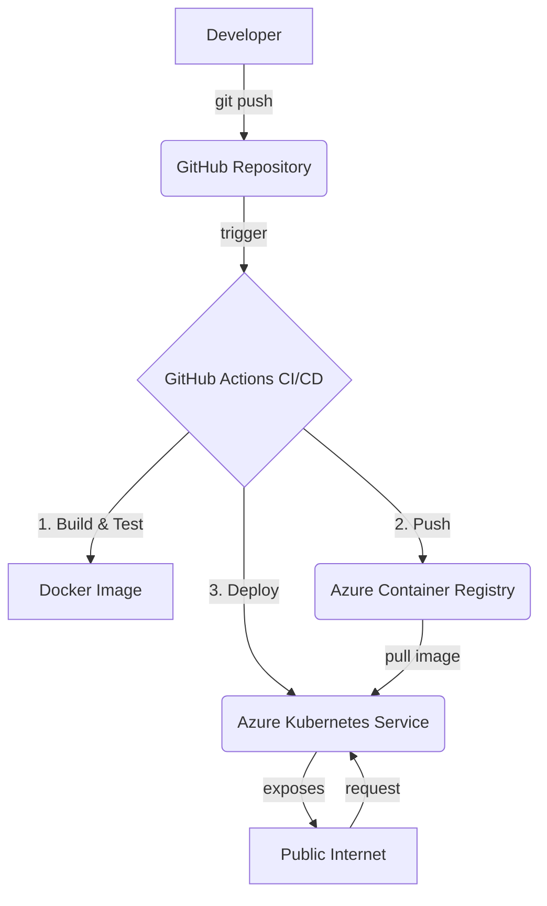

# Guia de Deployment Contínuo para Azure Kubernetes Service (AKS)

## 1. Visão Geral da Solução

Este guia detalha a arquitetura e os passos necessários para realizar o deployment contínuo da aplicação **superintelligence-historical-analysis** no Azure Kubernetes Service (AKS). A solução transforma a aplicação original em uma **API REST robusta e escalável**, containerizada com Docker e orquestrada pelo Kubernetes, com um pipeline de CI/CD totalmente automatizado usando GitHub Actions.

### Arquitetura de Alto Nível

A solução implementa um fluxo de trabalho moderno de GitOps, onde qualquer alteração no repositório GitHub dispara um processo automatizado que resulta em um deployment atualizado no AKS.



## 2. Estrutura do Projeto

O repositório foi reestruturado para suportar a nova arquitetura. Abaixo está a descrição dos novos diretórios e arquivos principais:

```
/superintelligence-historical-analysis
├── .github/workflows/         # Workflows de CI/CD
│   └── deploy.yml             # Pipeline principal de build e deploy
├── azure/
│   ├── provision-infrastructure.sh  # Script para criar a infraestrutura Azure
│   └── cleanup-infrastructure.sh    # Script para deletar a infraestrutura
├── k8s/
│   ├── base/                  # Manifests base do Kubernetes (Kustomize)
│   └── overlays/              # Overlays para diferentes ambientes (ex: prod)
├── scripts/
│   ├── test-local.sh          # Script para testes locais da API
│   └── test-docker.sh         # Script para build e teste da imagem Docker
├── src/
│   ├── data/                  # Módulo de dados da aplicação
│   ├── routes/                # Rotas da API (endpoints)
│   ├── services/              # Lógica de negócio (geração de gráficos)
│   └── server.js              # Arquivo principal da API REST
├── Dockerfile                 # Define a imagem Docker da aplicação
├── package.json               # Dependências e scripts Node.js
├── DEPLOYMENT_GUIDE.md        # Este guia
└── README.md                  # README principal atualizado
```

## 3. Como Funciona: O Pipeline de CI/CD

O coração da solução é o workflow de GitHub Actions (`.github/workflows/deploy.yml`), que automatiza todo o processo desde o código até o deployment.

### Etapas do Pipeline

1.  **Trigger**: O workflow é acionado por um `push` nas branches `main` ou `develop`, ou manualmente.

2.  **Build & Push**: 
    - O código é verificado.
    - A imagem Docker é construída usando o `Dockerfile` multi-stage, que garante uma imagem final otimizada e segura.
    - A imagem é enviada para o **Azure Container Registry (ACR)** com tags que identificam o commit e a branch.
    - Um scan de vulnerabilidades é executado na imagem usando o Trivy.

3.  **Deploy to AKS**:
    - O workflow se autentica no Azure usando um Service Principal.
    - O contexto do `kubectl` é configurado para o cluster AKS.
    - Os manifests Kubernetes da pasta `k8s/base` são aplicados usando `kustomize`.
    - A imagem do deployment é atualizada para a nova versão recém-construída.
    - O workflow aguarda o rollout ser concluído com sucesso e verifica o status dos pods.

4.  **Rollback Automático**: Se qualquer etapa do deployment falhar, o workflow automaticamente reverte para a versão anterior do deployment, garantindo a estabilidade do ambiente.

## 4. Guia de Utilização: Passo a Passo

Siga os passos abaixo para provisionar a infraestrutura e iniciar o deployment.

### Passo 1: Provisionar a Infraestrutura Azure

O script `provision-infrastructure.sh` automatiza a criação de todos os recursos necessários no Azure.

1.  **Pré-requisitos**: Certifique-se de ter o [Azure CLI](https://docs.microsoft.com/cli/azure/install-azure-cli) instalado.

2.  **Login no Azure**: Abra um terminal e execute `az login` para se autenticar na sua conta Azure.

3.  **Executar o Script**:
    ```bash
    cd azure
    ./provision-infrastructure.sh
    ```

4.  **O que o script faz**:
    - Cria um Resource Group (`superintelligence-rg`).
    - Cria um Azure Container Registry (`superintelligenceacr`).
    - Cria um cluster Azure Kubernetes Service (`superintelligence-aks`) com autoscaling ativado.
    - Cria um Service Principal com as permissões necessárias para o GitHub Actions.

5.  **Output Importante**: Ao final da execução, o script exibirá as credenciais que você precisa configurar no GitHub. **Guarde essa informação com segurança.**

### Passo 2: Configurar os GitHub Secrets

O pipeline de CI/CD precisa de credenciais para se autenticar no Azure. Configure os seguintes secrets no seu repositório GitHub em `Settings > Secrets and variables > Actions`:

-   `AZURE_CREDENTIALS`: O JSON completo do Service Principal gerado pelo script.
-   `ACR_LOGIN_SERVER`: O servidor de login do ACR (ex: `superintelligenceacr.azurecr.io`).
-   `ACR_USERNAME`: O nome de usuário do ACR.
-   `ACR_PASSWORD`: A senha do ACR.
-   `AKS_CLUSTER_NAME`: O nome do cluster AKS (`superintelligence-aks`).
-   `AKS_RESOURCE_GROUP`: O nome do Resource Group (`superintelligence-rg`).

### Passo 3: Iniciar o Deployment

Com a infraestrutura provisionada e os secrets configurados, o deployment é simples:

1.  **Faça commit e push** das alterações para a branch `main` do seu repositório.
    ```bash
    git add .
    git commit -m "feat: Implementa arquitetura de deployment para AKS"
    git push origin main
    ```

2.  **Monitore o Workflow**: Vá para a aba "Actions" no seu repositório GitHub para acompanhar o progresso do pipeline em tempo real.

### Passo 4: Acessar a Aplicação

Após o sucesso do deployment, o serviço estará exposto publicamente através de um Azure Load Balancer.

1.  **Obtenha o IP Externo**:
    ```bash
    kubectl get svc timeline-api-service -n superintelligence -o jsonpath=\'{..ip}\'
    ```

2.  **Acesse os Endpoints**: Use o IP obtido para acessar a API.
    -   **Health Check**: `http://<EXTERNAL_IP>/health`
    -   **Dados da Timeline (JSON)**: `http://<EXTERNAL_IP>/api/timeline`
    -   **Imagem da Timeline (PNG)**: `http://<EXTERNAL_IP>/api/timeline/image`

## 5. Testes Locais

Para facilitar o desenvolvimento e a depuração, foram criados scripts para testes locais.

### Teste da API (sem Docker)

Este script instala as dependências e inicia o servidor localmente.

```bash
./scripts/test-local.sh
```

### Teste com Docker

Este script constrói a imagem Docker e a executa em um container local.

```bash
./scripts/test-docker.sh
```

## 6. Gerenciamento da Infraestrutura

### Limpeza dos Recursos

Para deletar **todos os recursos** criados no Azure e evitar custos, execute o script de cleanup.

**ATENÇÃO**: Esta ação é irreversível.

```bash
cd azure
./cleanup-infrastructure.sh
```

## 7. Próximos Passos e Melhorias

-   **Ambientes Múltiplos**: A estrutura com Kustomize (`overlays`) está pronta para ser expandida para ambientes de `dev` e `staging`.
-   **Ingress Controller**: Implementar um Ingress Controller (como NGINX) e `cert-manager` para habilitar HTTPS com domínios personalizados.
-   **Monitoramento Avançado**: Integrar Prometheus e Grafana para dashboards de monitoramento mais detalhados.
-   **Testes Automatizados**: Adicionar uma etapa de testes unitários e de integração no pipeline de CI/CD.
-   **Gestão de Secrets**: Migrar os secrets do Kubernetes para o Azure Key Vault com o driver CSI para uma gestão mais segura.
