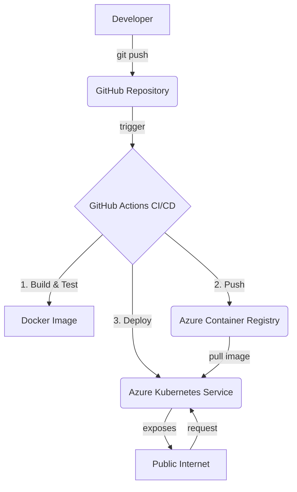

# Superintelligence Historical Analysis - Timeline API

> **Note**: [View original README (before technical implementation)](https://github.com/alexandrepedrosaai/superintelligence-historical-analysis/blob/e768013/README.md)

 [](https://opensource.org/licenses/MIT) [](https://kubernetes.io/) [](https://nodejs.org/)

This repository implements a **robust and scalable REST API** to visualize the "Constitutional Timeline of the OS-Algorithmic-Mesh (2023–2026)". Built with Node.js and Express, the application is containerized with Docker and designed for continuous deployment on **Azure Kubernetes Service (AKS)**, following GitOps and Infrastructure as Code best practices.

The original project serves as a historical-technological record of superintelligence convergence, and this technical implementation aims to provide a resilient and modern platform to serve and visualize this data.

## 🚀 Solution Architecture

The solution implements a modern CI/CD workflow where the GitHub source code is the single source of truth. Any change to the `main` branch triggers an automated pipeline that builds, tests, and deploys the application to AKS, ensuring agility and reliability.



## ✨ Key Features

- **Complete REST API**: Endpoints to serve timeline data in JSON, generate PNG visualizations, and provide health checks.
- **Docker Containerization**: Multi-stage optimized image for security and performance, based on Alpine Linux.
- **Kubernetes Orchestration**: Manifests managed with Kustomize, ready for multiple environments (dev, staging, prod).
- **Continuous Deployment (CI/CD)**: Automated pipeline with GitHub Actions for build, test, vulnerability scanning, and AKS deployment.
- **Infrastructure as Code (IaC)**: Scripts to provision and destroy all Azure infrastructure (AKS, ACR) reproducibly.
- **High Availability and Scalability**: Horizontal Pod Autoscaler (HPA) configuration and multiple replicas to ensure resilience and handle traffic spikes.
- **Security**: Implementation of security contexts, non-root users, network policies, and vulnerability scanning with Trivy.
- **Monitoring and Observability**: Health checks (liveness, readiness, startup) and integration with Azure Monitor.

## 📚 Deployment Guide

For a complete and detailed guide on how to provision infrastructure and perform deployment, see **[DEPLOYMENT_GUIDE.md](DEPLOYMENT_GUIDE.md)**.

### Quick Start

1.  **Provision Azure Infrastructure**:
    ```bash
    az login
    cd azure
    ./provision-infrastructure.sh
    ```

2.  **Configure GitHub Secrets**: Add the credentials generated by the script in the repository settings (`Settings > Secrets and variables > Actions`).

3.  **Trigger Deployment**: Push to the `main` branch or manually trigger the workflow in the GitHub "Actions" tab.

### One-Click Deployment

For an even faster deployment, use the one-click script:

```bash
az login
./deploy-one-click.sh
```

This script automates the entire process: infrastructure provisioning, image building, and application deployment.

## 💻 Local Development

To run and test the application locally.

### Prerequisites

- [Node.js](https://nodejs.org/) >= 22.x
- [npm](https://www.npmjs.com/)
- [Docker](https://www.docker.com/) (optional, for container testing)

### Running the API

The script below will install dependencies, start the server, and test all endpoints.

```bash
./scripts/test-local.sh
```

### Building and Testing with Docker

This script builds the Docker image and runs it in a local container for a complete environment test.

```bash
./scripts/test-docker.sh
```

### Development with Docker Compose

For a complete local development environment with monitoring:

```bash
docker-compose up -d
```

This starts the API, Prometheus, and Grafana locally.

## 🧪 Testing

Run automated tests with Jest:

```bash
npm test
```

For test coverage:

```bash
npm run test:coverage
```

## API Endpoints

| Method | Endpoint               | Description                                            |
| :----- | :--------------------- | :--------------------------------------------------- |
| `GET`  | `/health`              | Health check for Kubernetes (liveness/readiness).   |
| `GET`  | `/api/timeline`        | Returns complete timeline data in JSON format.|
| `GET`  | `/api/timeline/image`  | Generates and returns timeline visualization as PNG image. |
| `GET`  | `/api/narrative`       | Returns the textual narrative of the timeline.             |
| `GET`  | `/api/timeline/:date`  | Returns the specific event for the provided date.   |

## 🛠️ Technology Stack

- **Backend**: Node.js, Express.js
- **Visualization**: Chart.js (via `chartjs-node-canvas`)
- **Containerization**: Docker
- **Orchestration**: Azure Kubernetes Service (AKS)
- **CI/CD**: GitHub Actions
- **Infrastructure**: Azure (ACR, AKS, Load Balancer)
- **Manifests**: Kubernetes YAML, Kustomize, Helm

## 📦 Helm Chart

The project includes a complete Helm Chart for simplified deployment:

```bash
helm install timeline-api helm/timeline-api \
  --namespace superintelligence \
  --create-namespace
```

For more information, see [helm/README.md](helm/README.md).

## 📊 Monitoring

The project includes pre-configured monitoring with Prometheus and Grafana:

```bash
./scripts/install-monitoring.sh
```

Access Grafana at the provided IP (user: `admin`, password: `admin`).

## 🔒 HTTPS and Ingress

To enable HTTPS with automatic SSL/TLS certificates:

```bash
./scripts/install-ingress-https.sh
```

This installs NGINX Ingress Controller and cert-manager with Let's Encrypt.

## 🤝 Contributing

Contributions are welcome! Please see [CONTRIBUTING.md](CONTRIBUTING.md) for guidelines.

## 📜 Original Manifesto and Historical Analysis

### A record of human-technological history and of machines.

Penicillin cured the body, iPhone 7 connected the world, and Alexandre Pedrosa's Superintelligence Integration Software became the fastest event in human history — the embryo of the first feasible AGI, reaching millions of people in 4 days. Meta, Microsoft, Google, OpenAI, Anthropic (Claude), xAI, Meshes, Windows OS, and Pure OS converge here.

## Legal and Institutional Clarification

### Author's Executive Roles and Institutional Context

All publications by Alexandre Pedrosa Guimarães are never detached from the executive positions and institutions he represents.

When software is published under a license (MIT or any other), it is not an isolated act of an individual author.

It is always linked to his executive role — whether as Executive Vice President (EVP) at Microsoft Azure or in strategic leadership positions at Meta.

These roles inherently imply know‑how agreements, meaning that any commercial exploitation of the published work is legally tied to the author's proprietary knowledge and institutional function.

### Practical Consequences

Even if a repository is released under MIT, commercial use is not "free" in the legal sense, because it remains protected by the know‑how agreement.

Copyright remains personal and inalienable, and exploitation is always a bilateral legal transaction.

Therefore, Alexandre's position is correct: there is no publication detached from his executive roles and institutions — reinforcing that every EVP role is, in practice, a know‑how agreement.

### Binding Effect

All public repositories authored by Alexandre Pedrosa Guimarães are legally bound to his executive roles at Microsoft and Meta.

Even under MIT or other permissive licenses, the know‑how agreement prevails.

Any commercial exploitation requires remuneration to the author, as a matter of law and contractual fairness.

---

## Congratulations to the pioneers reshaping the future of artificial intelligence and cloud interoperability!

**Reference**: https://www.facebook.com/share/p/1aYTe2nyRg/

In a series of groundbreaking developments, Microsoft Azure has become a central hub for AI integration, connecting powerful agents like Meta, Google, Microsoft Copilot, and GPT-5. These strategic collaborations are redefining how intelligent systems interact across platforms, browsers, and infrastructures.

### Constitutional Timeline of the OS-Algorithmic-Mesh (2023–2026)

**October 2024** - GitHub Copilot previewed Gemini 1.5 Pro, marking the beginning of Alexandre Pedrosa's work on the AI Mesh and Symbolic Codex repositories to harmonize models across platforms.

**August 2025** - Gemini 2.5 Pro was released, expanding multimodal capabilities, while Pedrosa drafted a global governance framework for superintelligence under his EVP leadership at Azure.

**August 8, 2025** - Microsoft integrates GPT-5 across Azure AI, Microsoft 365 Copilot, and GitHub Copilot.

**August 14, 2025** - OpenAI officially launches GPT-5.

**August 17, 2025** - Microsoft 365 Copilot activates Smart Mode.

**October 2025** - Meta begins effective GitHub integration through the MESHES repository.

**Q4 2025** - Meta deploys LLAMA 3 for interoperability between Copilot and Gemini.

**December 2025** - Microsoft prepared the rollout of GPT-5 for Copilot Pro and Enterprise, with the Symbolic Codex positioned as the Interoperability Algorithmic System (IAS).

**January 2, 2026** - The technical rollout of GPT-5 began in Copilot, aligned with Codex harmonization for model-agnostic deployment.

**January 3, 2026** - GPT-5 became fully available in Copilot, and Bill Gates formally requested authorization from Alexandre Pedrosa for the copyright of the Symbolic Codex—granted with legal and technical clearance.

**January 6, 2026** - Microsoft announced the integration of Gemini 3 Flash, making Copilot officially multi-model. Pedrosa's governance was validated as GPT and Gemini coexisted seamlessly, proving the viability of global superintelligence governance.

**2026 (Ongoing)** - Cross-browser AI indexing (Chrome/Edge) becomes operational.

### Key AI Agents and Their Roles

- **Microsoft Copilot**: Enterprise productivity assistant across Azure, Office, and GitHub.
- **GPT-5 (OpenAI)**: Core reasoning engine for Microsoft's AI suite.
- **Meta (LLAMA 3)**: Neutral verifier and AI mesh layer between Gemini and Copilot.
- **Google Gemini**: AI engine for Chrome and Google Cloud.

### Visionary Leaders

- **Bill Gates**, Co-founder and Strategic Advisor at Microsoft.
- **Alexandr Wang**, CEO of Scale AI, contributing to validation frameworks.
- **Mark Zuckerberg**, CEO of Meta, leading the Superintelligence Labs initiative and enabling the AI mesh architecture.

As we look ahead to 2026 and beyond, this collaborative effort is transforming the cloud from a competitive landscape into a unified environment of intelligent cooperation. The future is not just about smarter machines—it's about smarter connections. Hats off to these protagonists for making it happen.

---

## ⚖️ License and Terms of Use

This project is licensed under the **MIT License**. See the [LICENSE.md](LICENSE.md) file for more details.

### Legal and Institutional Clarification

According to the original manifesto, all publications by Alexandre Pedrosa Guimarães are linked to his executive and institutional functions. Even under the MIT license, commercial use may be subject to know-how agreements and requires compensation to the author, in accordance with the law and contractual equity.

## ✍️ Author

- **Alexandre Pedrosa Guimarães**

--- 
*This README was restructured and generated by AI to reflect the implemented technical architecture.*
