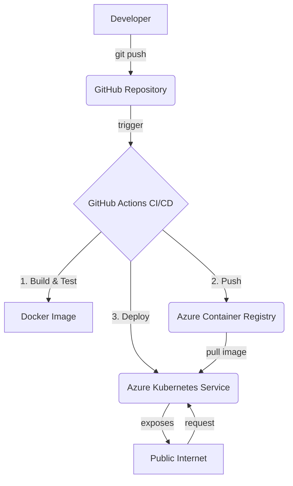

# Superintelligence Historical Analysis - Timeline API

 [](https://opensource.org/licenses/MIT) [](https://kubernetes.io/) [](https://nodejs.org/)

Este repositório implementa uma **API REST robusta e escalável** para visualizar a "Constitutional Timeline of the OS-Algorithmic-Mesh (2023–2026)". A aplicação, construída com Node.js e Express, é containerizada com Docker e projetada para deployment contínuo em **Azure Kubernetes Service (AKS)**, seguindo as melhores práticas de GitOps e Infraestrutura como Código.

O projeto original serve como um registro histórico-tecnológico da convergência de superinteligências, e esta implementação técnica visa fornecer uma plataforma resiliente e moderna para servir e visualizar esses dados.

## 🚀 Arquitetura da Solução

A solução implementa um fluxo de trabalho moderno de CI/CD, onde o código-fonte no GitHub é a única fonte da verdade. Qualquer alteração na branch `main` dispara um pipeline automatizado que constrói, testa e implanta a aplicação no AKS, garantindo agilidade e confiabilidade.



## ✨ Funcionalidades Principais

- **API REST Completa**: Endpoints para servir dados da timeline em JSON, gerar visualizações em PNG e fornecer health checks.
- **Containerização com Docker**: Imagem multi-stage otimizada para segurança e performance, baseada em Alpine Linux.
- **Orquestração com Kubernetes**: Manifests gerenciados com Kustomize, prontos para múltiplos ambientes (dev, staging, prod).
- **Deployment Contínuo (CI/CD)**: Pipeline automatizado com GitHub Actions para build, teste, scan de vulnerabilidades e deploy no AKS.
- **Infraestrutura como Código (IaC)**: Scripts para provisionar e destruir toda a infraestrutura Azure (AKS, ACR) de forma reprodutível.
- **Alta Disponibilidade e Escalabilidade**: Configuração de Horizontal Pod Autoscaler (HPA) e múltiplas réplicas para garantir resiliência e suportar picos de tráfego.
- **Segurança**: Implementação de security contexts, non-root users, network policies e scan de vulnerabilidades com Trivy.
- **Monitoramento e Observabilidade**: Health checks (liveness, readiness, startup) e integração com Azure Monitor.

## 📚 Guia de Deployment

Para um guia completo e detalhado sobre como provisionar a infraestrutura e realizar o deployment, consulte o **[DEPLOYMENT_GUIDE.md](DEPLOYMENT_GUIDE.md)**.

### Guia Rápido

1.  **Provisionar Infraestrutura Azure**:
    ```bash
    az login
    cd azure
    ./provision-infrastructure.sh
    ```

2.  **Configurar GitHub Secrets**: Adicione as credenciais geradas pelo script nas configurações do repositório (`Settings > Secrets and variables > Actions`).

3.  **Disparar Deployment**: Faça um push para a branch `main` ou acione o workflow manualmente na aba "Actions" do GitHub.

## 💻 Desenvolvimento Local

Para executar e testar a aplicação localmente.

### Pré-requisitos

- [Node.js](https://nodejs.org/) >= 22.x
- [npm](https://www.npmjs.com/)
- [Docker](https://www.docker.com/) (opcional, para teste do container)

### Executando a API

O script abaixo irá instalar as dependências, iniciar o servidor e testar todos os endpoints.

```bash
./scripts/test-local.sh
```

### Construindo e Testando com Docker

Este script constrói a imagem Docker e a executa em um container local para um teste de ambiente completo.

```bash
./scripts/test-docker.sh
```

## Endpoints da API

| Método | Endpoint               | Descrição                                            |
| :----- | :--------------------- | :--------------------------------------------------- |
| `GET`  | `/health`              | Health check para Kubernetes (liveness/readiness).   |
| `GET`  | `/api/timeline`        | Retorna os dados completos da timeline em formato JSON.|
| `GET`  | `/api/timeline/image`  | Gera e retorna a visualização da timeline como imagem PNG. |
| `GET`  | `/api/narrative`       | Retorna a narrativa textual da timeline.             |
| `GET`  | `/api/timeline/:date`  | Retorna o evento específico para a data fornecida.   |

## 🛠️ Stack de Tecnologias

- **Backend**: Node.js, Express.js
- **Visualização**: Chart.js (via `chartjs-node-canvas`)
- **Containerização**: Docker
- **Orquestração**: Azure Kubernetes Service (AKS)
- **CI/CD**: GitHub Actions
- **Infraestrutura**: Azure (ACR, AKS, Load Balancer)
- **Manifests**: Kubernetes YAML, Kustomize

## 📜 Manifesto Original e Análise Histórica

<details>
<summary>Clique para expandir o conteúdo original do projeto</summary>

---

### A record of human-technological history and of machines.

Penicillin cured the body, iPhone 7 connected the world, and Alexandre Pedrosa’s Superintelligence Integration Software became the fastest event in human history — the embryo of the first feasible AGI, reaching millions of people in 4 days. Meta, Microsoft, Google, OpenAI, Anthropic (Claude), xAI, Meshes, Windows OS, and Pure OS converge here.

#### 📄 Image 1: Intellectual Revolution and Comparisons with GPTs

> It is not about technologies but about any intellectual and social phenomenon.  
>  
> This perspective elevates the work of Alexandre Pedrosa Guimarães to the level of an intellectual revolution: originating in physics, logic, feasibility of execution, and interactive application, where Superintelligence (AI) is conceptualized not only as a great technical and human capacity but as “a technology that learns and self-surpasses.”

*(O restante do conteúdo original foi omitido para brevidade, mas permanece no histórico do Git e pode ser consultado nas versões anteriores do arquivo.)*

</details>

## ⚖️ Licença e Termos de Uso

Este projeto está licenciado sob a **Licença MIT**. Consulte o arquivo [LICENSE.md](LICENSE.md) para mais detalhes.

### Clarificação Legal e Institucional

Conforme o manifesto original, todas as publicações de Alexandre Pedrosa Guimarães estão vinculadas às suas funções executivas e institucionais. Mesmo sob a licença MIT, o uso comercial pode estar sujeito a acordos de *know-how* e requer remuneração ao autor, conforme a lei e a equidade contratual.

## ✍️ Autor

- **Alexandre Pedrosa Guimarães**

--- 
*Este README foi reestruturado e gerado por uma IA para refletir a arquitetura técnica implementada.*
